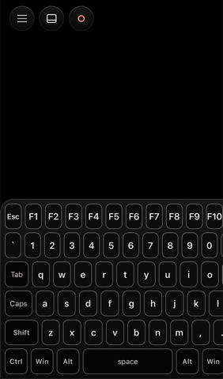
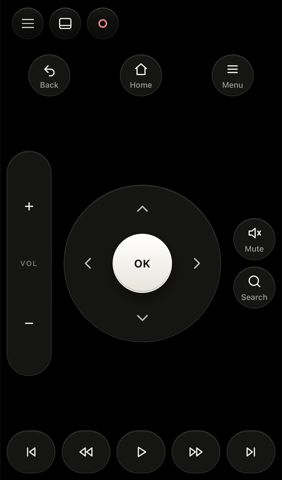
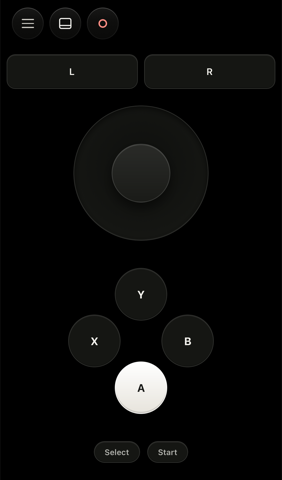
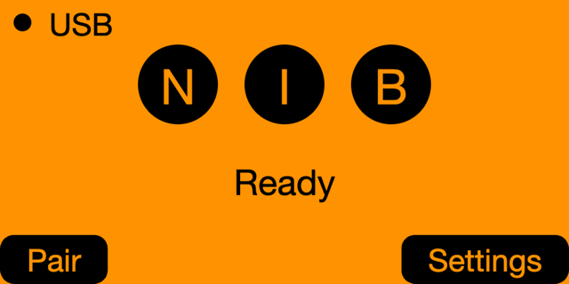
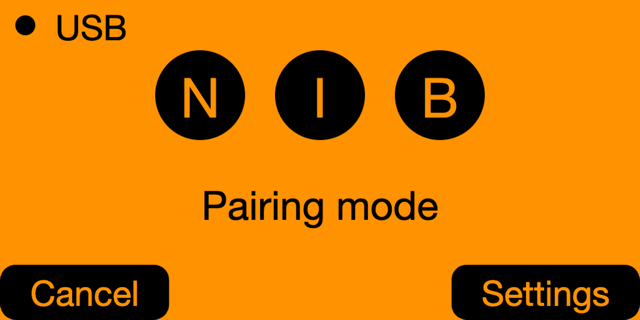
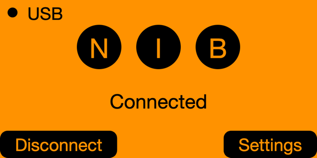

<div align="center">


# N.I.B.

**Nearby Input Bridge.** Your phone becomes a keyboard, trackpad, password typer,
media remote and gamepad for any computer. A small Bluetooth dongle does the
typing, so the computer needs no driver and no software.


```
phone browser  ──Web Bluetooth──►  dongle  ──USB HID──►  any computer
```

</div>

The computer sees a plain USB keyboard and mouse. No driver, no pairing, nothing
installed on that side. It works at the login screen and inside full-screen apps.
The dongle is either a cheap **ESP32-S3** board or a **Flipper Zero** running the
same app.

## Screenshots

The phone app, connected to a dongle:

<table>
<tr>
<td align="center"><br><sub>Full keyboard with a function row</sub></td>
<td align="center"><br><sub>TV remote for a TV box</sub></td>
<td align="center"><br><sub>Gamepad with an analogue stick</sub></td>
</tr>
</table>

The Flipper Zero build, on the device's own screen:

<p>



</p>

## Why

The USB Rubber Ducky and MalDuino put a payload on a stick and run it when you
plug it in. N.I.B. points the same hardware idea the other way. It stores no
payload and runs nothing on its own. You hold the other end.

The password typer is the feature I built it for. A phone holds good passwords
and has no easy way to get them into a machine that is not the phone. Autofill
puts the password in a form field, and the dongle types it.

## The name

A nib is the tip of a pen, the small part that puts the words on the page. That
is what the dongle is: you do the thinking on the phone, and the dongle writes
on the other computer. The name started there.

The letters came next: **N**earby **I**nput **B**ridge. Your phone is the input,
the dongle is the bridge, and it only works nearby. Out of Bluetooth range it
does nothing.

It beat the other candidates because it is also "N.I.B.", the Black Sabbath song
from their 1970 debut.

## Choose your dongle

You need one of these. Both run the same phone app and speak the same protocol.

| | ESP32-S3 dongle | Flipper Zero |
|---|---|---|
| Cost | a ~£4 board | hardware you already own |
| Always on | yes, plug and forget | no, the app must stay in the foreground |
| Screen, screensavers, button | yes | uses the Flipper's screen and buttons |
| Setup | flash once with PlatformIO | build once with ufbt, or sideload the `.fap` |

Jump to [Build the ESP32 dongle](#build-the-esp32-dongle) or
[Install on a Flipper Zero](#install-on-a-flipper-zero), then
[Use the app](#use-the-app).

## Build the ESP32 dongle

### The hardware

The board I built this on is an **ESP32-S3 pocket dongle with a 0.96-inch ST7735
screen (160x80)**, about £4:

> https://www.aliexpress.com/item/1005010471540760.html

Any ESP32-S3 board works. The screen and button are optional. The S3 is not a
preference. It is the only ESP32 with both USB OTG and Bluetooth LE. The S2 has
USB and no Bluetooth, the original ESP32 has Bluetooth and no native USB, and the
C3 and C6 have a USB serial port that cannot act as a keyboard.

### Flash it

1. **Install PlatformIO Core.** `pip install platformio`, or the
   [PlatformIO IDE extension](https://platformio.org/install) for VS Code.
2. **Clone this repo** and enter the firmware folder:
   ```bash
   git clone https://github.com/gabrielbelli/nib.git
   cd nib/firmware
   ```
3. **Plug the board into its native USB port.** Many S3 devkits have two ports,
   one to a serial bridge and one to the chip itself. Use the native one, usually
   marked USB rather than COM or UART. This one costs people an afternoon.
4. **Build and upload:**
   ```bash
   pio run -e pocket-dongle-s3 -t upload   # the board above
   pio run -e generic-s3      -t upload    # any other S3, no screen, no button
   ```
   The first build downloads the toolchain and can take a few minutes.
5. **Done.** The dongle shows its passkey on the screen (or on the serial console
   with no screen). Move on to [Use the app](#use-the-app).

The ESP32 build is always on: plug it in and it stays a working dongle, with an
idle screen, screensavers, on-device settings and a hardware button. Everything
that is not a prebuilt board is a [build flag](#build-flags-esp32).

## Install on a Flipper Zero

If you already own a Flipper Zero, it is a dongle with no soldering. Two ways in.

### A. Build and install with ufbt (recommended)

1. **Install [ufbt](https://pypi.org/project/ufbt/)** in a virtual environment:
   ```bash
   cd nib/flipper
   python3 -m venv .venv-ufbt && . .venv-ufbt/bin/activate
   pip install ufbt
   export UFBT_HOME="$PWD/.ufbt"
   ```
2. **Fetch the SDK** (first time only): `ufbt update`.
3. **Connect the Flipper by USB**, close any app on it, then:
   ```bash
   ufbt launch     # builds, installs to Apps/USB, and starts it
   ```
   To build the `.fap` without a device, run `ufbt` on its own. It lands at
   `flipper/dist/nib.fap`.

### B. Sideload the `.fap` (no toolchain)

1. Build `dist/nib.fap` with step A, or get it from a release.
2. Open [qFlipper](https://flipperzero.one/update), or the Flipper mobile app.
3. Copy `nib.fap` to the SD card under `apps/USB/`.
4. On the Flipper, open **Apps → USB → N.I.B.**

### Using it on the Flipper

- Press **Pair** (the Left button, or OK) to enter pairing mode. The screen shows
  **Pairing mode** and the phone can now find it.
- Connect from the phone and enter the PIN the Flipper shows. The screen shows
  **Connected**.
- Press **Settings** (Right) to change the advertised name, disguise it as a
  plain keyboard, or forget paired phones.
- Hold **Back** to exit. A short Back press does nothing, so you cannot drop the
  session by accident.

It uses PIN pairing, keeps its own bonds separate from the Flipper's, and stays
silent until you enter pairing mode. The one caveat is inherent to the Flipper:
it has no background mode, so the app must stay in the foreground while you use
it. More detail is in [`flipper/README.md`](flipper/README.md).

## Use the app

The app is static files. No server, no build step, no dependencies.

1. **Serve it over HTTPS.** Web Bluetooth only runs in a secure context, so
   `file://` will not work.
   ```bash
   python3 serve.py    # setup page on :8088, app on :9443 over HTTPS
   ```
   Or put `web/` on GitHub Pages or any static host. It behaves the same, and
   publishing the page gives nothing away (see [Privacy](#privacy)).
2. **Open the app** in a supported browser and tap **Connect**.
3. **Pick your dongle** from the Bluetooth list and enter its passkey once.
4. **Type, point, or switch layouts** from the menu.

| Platform | Browser | Works |
|---|---|---|
| Android | Chrome, Edge | yes |
| iOS | Bluefy, WebBLE | yes |
| iOS | Safari | no Web Bluetooth |
| Desktop | Chrome, Edge, Brave | yes |
| Linux desktop | Chrome | behind a `chrome://flags` switch |
| any Safari or Firefox | — | no Web Bluetooth |

## Layouts

The keyboard button swaps the trackpad for one of these, chosen in the menu:

| Layout | For |
|---|---|
| Compact, 60%, 65%, Full | typing, from phone-sized to a full keyboard with a function row |
| Numpad, Nav | numbers; arrows and paging one-handed |
| Media | playback, volume, brightness, browser and launch keys |
| Slides | a presentation clicker: Next, Previous, black, white, start, end |
| TV remote | a D-pad with OK, Home, Back, Menu, volume and playback for a TV box |
| Gamepad, Classic pad, Classic stick | two sticks, D-pad, A/B/X/Y, shoulders and triggers |

Media, volume and TV keys travel on a USB consumer-control interface, so the
computer treats them as real media keys, not F-keys. The gamepad drives a
standard USB gamepad that Linux, Android and Steam read directly. The gamepad is
ESP32-only, since the Flipper's USB has no gamepad descriptor.

## Keyboard layout

A HID keyboard sends key positions, not characters. The computer decides what a
position means, so pick the matching layout in the menu, or a password with `@`,
`/` or `;` in it will arrive as something else.

US and ABNT2 ship in `web/keymap.js`. ABNT2 uses dead keys, so one character can
expand to two keystrokes. Adding a layout means adding one table to that file.

## Windows, Mac and Linux

The dongle sends key positions and relative mouse motion, which every desktop OS
takes with no driver. Only names and shortcuts differ, and the app handles them.

- **Which computer.** The menu's Computer setting defaults to Auto, which means
  Windows until the dongle knows more. On each plug-in the dongle listens for the
  lock-light report that Windows and Linux send and macOS does not, then reports
  what it heard so Auto can follow.
- **Controlling one OS from another.** In capture mode the modifiers translate by
  position: a Mac's Ctrl, Opt and Cmd land on a PC's Ctrl, Win and Alt, and back.
  The menu also offers "for shortcuts", "as labelled" and a custom table, and the
  capture panel shows each translation live.

No browser can capture the controlling machine's own OS shortcuts (Cmd+Tab,
Alt+Tab, Ctrl+Alt+Del). Those reach the local machine first, so the on-screen
keyboard sends them instead. Typing in a BIOS needs a boot-protocol keyboard,
which the firmware does not have yet.

## Security

The dongle refuses input until a phone bonds with a passkey over an encrypted
link. On the ESP32 the passkey shows on the screen or the serial console. On the
Flipper the code shows on its screen during pairing, and the app stays silent
until you enter pairing mode.

You cannot lock yourself out of the ESP32 build. The menu, the button's 30-second
hold, and the ROM bootloader are three independent ways back in, and no firmware
setting can disable the last one. Flash encryption and Secure Boot would close
the remaining physical-access gaps, but both can brick a board, so this project
does not burn them.

## Privacy

No server, no backend, no analytics, no third-party request of any kind. No
fonts, no CDN, no framework. Open developer tools and the only traffic is the
files themselves.

Passwords go from your password manager into a form field and become key
positions in the page. Closing the tab ends them. Snippets stay in that browser's
`localStorage`, and settings live on the dongle. Hosting the page publicly is
safe: it does nothing for anyone out of Bluetooth range, or without the passkey.

## Build flags (ESP32)

`#ifndef` guards every value in `firmware/src/config.h`, so a `-D` flag overrides
any of them and you never edit the file. Pass them in an environment's
`build_flags`, or once from the shell:

```bash
PLATFORMIO_BUILD_FLAGS='-DNIB_DEFAULT_PAIR_MODE=1' pio run -e generic-s3 -t upload
```

| Flag | Default | Effect |
|---|---|---|
| `NIB_DEVICE_NAME` | `"N.I.B."` | Bluetooth and USB name |
| `NIB_PASSKEY` | `424242` | first-boot passkey |
| `NIB_DEFAULT_PASSKEY_MODE` | `0` | 0 fixed, 1 new each boot, 2 new on unpair |
| `NIB_DEFAULT_PAIR_MODE` | `0` | 0 any time, 1 pairing window only |
| `NIB_DEFAULT_USB_MODE` | `0` | 0 console, 1 console without reflash, 2 none |
| `NIB_DEFAULT_HID_IDENTITY` | `0` | 0 device name, 1 "USB Keyboard" |
| `NIB_BTN_PIN` | `0` | button GPIO, `-1` for none |
| `NIB_LCD_ENABLED` | `1` | `0` compiles the screen out |
| `NIB_LCD_*` | Pocket-Dongle | pins, driver (`7735`/`7789`), size, offsets |

The two environments are the only prebuilt boards. Everything else is a flag.

| Environment | Board |
|---|---|
| `pocket-dongle-s3` | the 0.96-inch ST7735 dongle above, with the BOOT button |
| `generic-s3` | any other ESP32-S3, assumed to have no screen and no button |

## Layout of the repo

| Path | What it is |
|---|---|
| `firmware/` | ESP32-S3 firmware (PlatformIO): protocol, screen, settings, screensavers |
| `firmware/src/protocol.h` | the Bluetooth wire format, documented |
| `flipper/` | the Flipper Zero app (ufbt), sharing the wire protocol |
| `web/` | the phone app: one trackpad, the layouts, the menu, the transport |
| `web/keymap.js` | characters to key positions, one table per layout |
| `web/target.js` | Windows / Mac / Linux target and the modifier mapping |
| `tools/e2e/` | browser tests (WebKit and Chromium): `cd tools/e2e && npm i && npm test` |
| `tools/lcdsim/` | renders the ESP32 screens and screensavers to images on a computer |
| `serve.py` | local HTTPS for testing on a phone |

The protocol is a short list of plain-byte opcodes. Read `firmware/src/protocol.h`
and you can write your own client.

## Credits

The interface borrows its design language from
[Nacre UI](https://github.com/johnmamanao/nacre-ui) by
[John Mamanao](https://github.com/johnmamanao), MIT licensed. It copies no code,
and the dark palette departs from its light default. The debt is taste, not
source. MalDuino by [Seytonic](https://maltronics.com) is the ancestor of the
idea.

## Licence

BSD 2-Clause. See [LICENSE](LICENSE).
